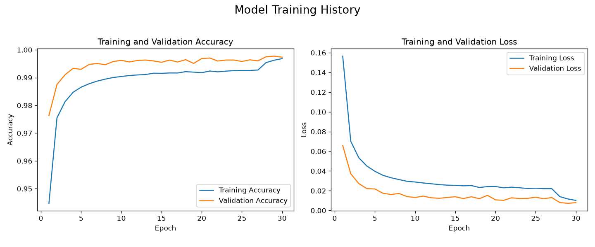
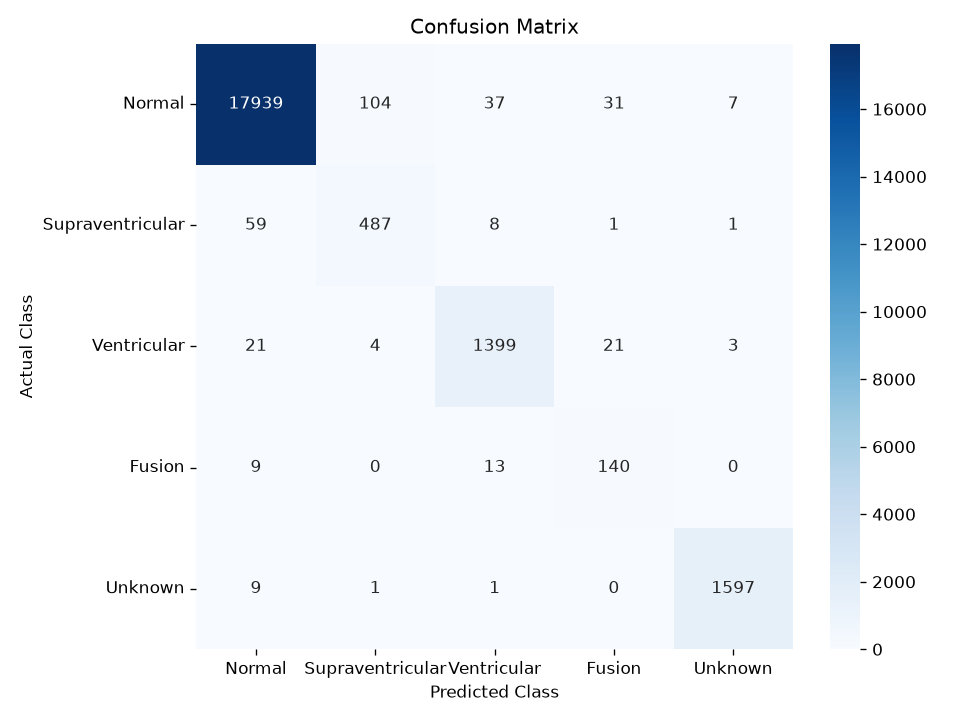

# ECG Heartbeat Classification with a 1D CNN (PyTorch)

A deep-learning pipeline that classifies individual heartbeats from raw ECG
signals into five arrhythmia categories (AAMI standard) using a **1D
Convolutional Neural Network built in PyTorch**, with **CUDA/GPU acceleration**,
SMOTE for class imbalance, an interactive Streamlit demo, a test suite, and
Docker packaging.


## Table of Contents
- [Overview](#overview)
- [Results](#results)
- [Dataset](#dataset)
- [Model Architecture](#model-architecture)
- [Project Structure](#project-structure)
- [Setup](#setup)
- [Usage](#usage)
- [Interactive Demo](#interactive-demo)
- [Testing](#testing)
- [Docker](#docker)
- [Design Notes](#design-notes)
- [License & Acknowledgements](#license--acknowledgements)

## Overview

Automatically classifying heartbeats is a core task in detecting cardiac
arrhythmias. This project learns features **directly from the raw single-beat
waveform** (no hand-crafted features) with a 1D CNN and distinguishes Normal
beats from four arrhythmia types.

**Highlights**
- 🧠 **PyTorch 1D-CNN** — 3 convolutional blocks + a dense classifier head.
- ⚡ **GPU training** — CUDA with automatic mixed precision (AMP).
- ⚖️ **Class-imbalance handling** — SMOTE oversampling of minority classes.
- 🔁 **Correct inference** — the fitted `StandardScaler` is saved during
  training and reused at evaluation/prediction time (no train/serve skew).
- 🛑 **Robust training loop** — early stopping, `ReduceLROnPlateau`, and
  best-checkpoint saving by validation accuracy.
- 🖥️ **Streamlit demo**, ✅ **pytest suite**, and 🐳 **Dockerfile**.

## Results

Trained for 30 epochs on an NVIDIA RTX 3060 (CUDA, mixed precision) in ~8
minutes. Best validation accuracy **99.78%**. On the held-out test set
(21,892 beats):

| Metric | Value |
|---|---|
| **Test accuracy** | **98.49%** |
| Weighted F1 | 0.985 |
| Macro F1 | 0.917 |

Per-class performance (test set):

| Class | Precision | Recall | F1 | Support |
|---|---|---|---|---|
| Normal           | 0.995 | 0.990 | 0.992 | 18,118 |
| Supraventricular | 0.817 | 0.876 | 0.846 |    556 |
| Ventricular      | 0.960 | 0.966 | 0.963 |  1,448 |
| Fusion           | 0.725 | 0.864 | 0.789 |    162 |
| Unknown          | 0.993 | 0.993 | 0.993 |  1,608 |

As expected, the rare minority classes (Supraventricular, Fusion) are hardest;
SMOTE substantially improves their recall versus training on the raw imbalance.

Reproduce with `python main.py train && python main.py evaluate`.

| Training history | Confusion matrix |
|---|---|
|  |  |

## Dataset

**MIT-BIH Arrhythmia Database**, pre-processed into fixed-length beats and
distributed as CSV on Kaggle.

- **Source:** [ECG Heartbeat Categorization Dataset (Kaggle)](https://www.kaggle.com/datasets/shayanfazeli/heartbeat)
- **Files:** `mitbih_train.csv` (87,554 beats), `mitbih_test.csv` (21,892 beats)
- **Format:** each row = one heartbeat. Columns `0..186` are the signal
  (normalised to `[0, 1]`, zero-padded to 187 samples); column `187` is the label.
- **Classes (AAMI):** `0` Normal · `1` Supraventricular · `2` Ventricular ·
  `3` Fusion · `4` Unknown. The data is **heavily imbalanced** (mostly Normal),
  which SMOTE addresses during training.

**Download:** grab both CSVs from the Kaggle link and place them in `data/`:
```
data/mitbih_train.csv
data/mitbih_test.csv
```
(The CSVs are ~490 MB total and are git-ignored, not committed.)

## Model Architecture

`src/model.py` — `ECGCNN(nn.Module)`; input `(batch, 1, 187)`, output 5 logits.

```
Input (1 × 187)
 ├─ Conv1d(1→64, k=5, same)  → BatchNorm → ReLU → MaxPool(2) → Dropout(0.2)
 ├─ Conv1d(64→128, k=5, same)→ BatchNorm → ReLU → MaxPool(2) → Dropout(0.3)
 ├─ Conv1d(128→256, k=3,same)→ BatchNorm → ReLU → MaxPool(2) → Dropout(0.3)
 ├─ Flatten
 ├─ Linear(→256) → BatchNorm → ReLU → Dropout(0.4)
 └─ Linear(256→5)  (softmax applied at inference)
```

Loss: `CrossEntropyLoss`. Optimizer: `Adam` (lr `1e-3`, weight decay `1e-5`).
Scheduler: `ReduceLROnPlateau`. Mixed precision on CUDA via `torch.amp`.

## Project Structure

```
ECG-Heartbeat-Classification/
├── main.py                  # CLI entry point (train / evaluate / predict)
├── requirements.txt
├── pyproject.toml           # installable package + console script
├── Dockerfile / .dockerignore
├── conftest.py
├── data/                    # MIT-BIH CSVs (download; git-ignored)
├── saved_models/            # checkpoint (.pt) + scaler (.joblib) [git-ignored]
├── visualizations/          # training_history.png, confusion_matrix.png
├── notebooks/
│   └── 1_Data_Exploration.ipynb
├── app/
│   └── streamlit_app.py     # interactive demo
├── src/
│   ├── config.py            # paths & hyper-parameters
│   ├── data_loader.py       # load, scale (+save scaler), SMOTE, torch Dataset
│   ├── model.py             # ECGCNN + checkpoint load/save
│   ├── train.py             # training loop (AMP, early stop, scheduler)
│   ├── evaluate.py          # test-set metrics + confusion matrix
│   ├── predict.py           # single-beat inference
│   ├── utils.py             # seeding, device, plotting, reports
│   └── cli.py               # argparse CLI
└── tests/                   # pytest suite
```

## Setup

Requires **Python 3.11**. For GPU training you need an NVIDIA GPU + recent driver.

```bash
# 1. Create and activate a virtual environment
python -m venv .venv
# Windows:
.venv\Scripts\activate
# macOS/Linux:
source .venv/bin/activate

# 2a. GPU (CUDA 12.4) — recommended if you have an NVIDIA GPU
pip install torch --index-url https://download.pytorch.org/whl/cu124
pip install -r requirements.txt

# 2b. CPU-only alternative
pip install -r requirements.txt
```

Verify CUDA is picked up:
```bash
python -c "import torch; print('CUDA available:', torch.cuda.is_available())"
```

## Usage

All commands run from the project root via `main.py`:

```bash
# Train (saves best checkpoint + scaler to saved_models/, plots to visualizations/)
python main.py train                 # 30 epochs (configurable in src/config.py)
python main.py train --epochs 10     # shorter run

# Evaluate on the test set (prints per-class report, saves confusion matrix)
python main.py evaluate

# Classify a single heartbeat from the test set
python main.py predict --sample-index 100
```

After `pip install -e .` you can also use the `ecg-classify` console script
(`ecg-classify train`, etc.).

## Interactive Demo

A Streamlit app lets you pick a test beat (or a random segment), view the
waveform, and see predicted class probabilities:

```bash
streamlit run app/streamlit_app.py
```

## Testing

```bash
pytest -q
```
Tests cover preprocessing/scaler round-trips, SMOTE balancing, the model's
forward/backward pass, and checkpoint save/load. Tests that need PyTorch skip
cleanly if it isn't installed.

## Docker

```bash
# Build
docker build -t ecg-classifier .

# Run the demo (mount data + a trained model)
docker run --rm -p 8501:8501 \
  -v ${PWD}/data:/app/data \
  -v ${PWD}/saved_models:/app/saved_models \
  ecg-classifier

# Or train inside the container
docker run --rm -v ${PWD}/data:/app/data -v ${PWD}/saved_models:/app/saved_models \
  ecg-classifier python main.py train
```

## Design Notes

- **No train/serve skew.** Earlier versions re-fit the scaler at inference on
  raw data, scaling inputs differently than the model was trained on. Here the
  scaler is fit once, **saved with `joblib`**, and reloaded everywhere.
- **SMOTE in the scaled space.** Features are standardised before SMOTE so the
  oversampler's nearest-neighbour distances are well-behaved.
- **Reproducibility.** A single `set_seed` seeds Python, NumPy and PyTorch
  (incl. CUDA).
- **Config-driven.** All paths and hyper-parameters live in `src/config.py`.

## License & Acknowledgements

Licensed under the **MIT License** — see [LICENSE](LICENSE).

- MIT-BIH Arrhythmia Database — Moody GB, Mark RG, *IEEE Eng Med Biol Mag*, 2001.
- Goldberger AL et al., *PhysioBank, PhysioToolkit, and PhysioNet*, Circulation, 2000.
- Kaggle dataset preparation by Shayan Fazeli.
